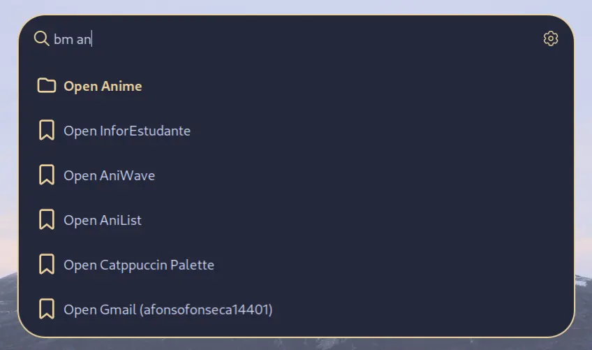

  

# About
This extension let's you add bookmarks and groups of bookmarks to whiskers launcher. It makes opening your favourite websites easier.

# How To Use
## Add Bookmark/Group
You can add bookmarks and groups just by selecting one of the initial options.

## Edit Bookmark/Group
If you type the extension keyword and then `e {bookmark/group name}` or `edit {bookmark/group name}` and select the option you will get a window to add the fields for the respective type.

## Delete Bookmark/Group
If you type the extension keyword and then `d {bookmark/group name}` or `delete {bookmark/group name}` and select the option you will delete the bookmark/group.
